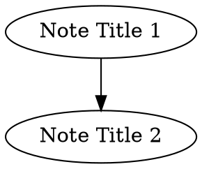

# Implementation Plan

## Progress Checklist

### Milestone 1: Core CLI (Complete)

- [x] **Phase 1**: Project Setup & Foundation (config, vault init)
- [x] **Phase 2**: Note Data Model (frontmatter, tags, note struct)
- [x] **Phase 3**: `log` Command
- [x] **Phase 4**: `search` Command
- [x] **Phase 5**: `update` Command
- [x] **Phase 6**: Additional Commands (`init`, `config`, `doctor`)
- [x] **Phase 7**: Metadata Management (tags index, `query` command)
- [x] **Phase 8**: CLI Polish (flags, error handling, testing)

### Milestone 2: Enhanced Features

- [x] **Phase 9**: Date Utilities
  - [x] 9.1 Date parsing library (`internal/dateparse`)
  - [x] 9.2 `today` command
  - [x] 9.3 `yesterday` command
- [x] **Phase 10**: Enhanced Search
  - [x] 10.1 Date filters (`created:`, `before:`, `after:`, `on:`, `between:`)
  - [x] 10.2 Natural language dates (`today`, `last-week`, `7d`, etc.)
  - [x] 10.3 Additional filters (`title:`, `path:`)
- [x] **Phase 11**: Search Performance
  - [x] 11.1 Tag-only search optimization (frontmatter-only parsing)
  - [x] 11.2 Early termination for `--limit`
  - [x] 11.3 Concurrent file reading (2x speedup)
- [ ] **Phase 12**: Frontmatter Enhancements
  - [ ] 12.1 `--show-extra` flag for displaying user fields
  - [ ] 12.2 `--with-frontmatter` flag for bulk export
  - [ ] 12.3 Frontmatter editing in `update` command
- [ ] **Phase 13**: Tag Management
  - [ ] 13.1 `tags list` subcommand
  - [ ] 13.2 `tags rename` subcommand
  - [ ] 13.3 `tags delete` subcommand
- [ ] **Phase 14**: Documentation
  - [ ] 14.1 Man page generation (`cobra-doc`)
  - [ ] 14.2 Markdown documentation (`docs/`)
  - [ ] 14.3 Enhanced `--help` with examples
- [ ] **Phase 15**: Developer Experience
  - [ ] 15.1 Shell completions (`completion` command)
  - [ ] 15.2 Note templates (`--template` flag)

### Milestone 3: Advanced Features (Future)

- [ ] **Phase 16**: Graph & Links
  - [ ] 16.1 Backlinks command
  - [ ] 16.2 Graph export (DOT format)
- [ ] **Phase 17**: Extended Functionality
  - [ ] 17.1 Custom sort order (`order` field)
  - [ ] 17.2 Note archiving
  - [ ] 17.3 Extended search operators (OR, NOT, grouping, phrase)

---

## CLI Specification (Finalized)

> Design target: **Script-first** (embedded tool). Human usability secondary.

### Global Flags

| Flag | Short | Env Var | Description |
|------|-------|---------|-------------|
| `--help` | `-h` | — | Show help |
| `--version` | — | — | Print version to stdout |
| `--vault` | — | `RUIN_VAULT` | Override vault path |
| `--config` | — | `RUIN_CONFIG` | Override config file path |
| `--json` | — | — | Output JSON to stdout (where supported) |
| `--no-color` | — | `NO_COLOR` | Disable colored output |

**Config precedence** (high → low): flags > env > config file (`~/.config/ruin`)

### Exit Codes

| Code | Meaning |
|------|---------|
| `0` | Success |
| `1` | No matches (search) or general error |
| `2` | Invalid usage / parse error |
| `3` | User aborted (declined confirmation) |

### I/O Contract

| Stream | Content |
|--------|---------|
| stdout | Primary output (paths, content, JSON) |
| stderr | Errors, confirmations |

**TTY behavior**: Prompts only when stderr is a TTY. Non-interactive mode requires `--force` for destructive operations.

---

## Phase 1: Project Setup & Foundation

### 1.1 Initialize Go Module
- Run `go mod init`
- Add dependencies: cobra, yaml.v3, uuid
- Create directory structure

### 1.2 Config System (`internal/config/`)
- Define config struct with `vault_path` field
- Load from `~/.config/ruin` (YAML format)
- Support `RUIN_CONFIG` env var override
- Support `RUIN_VAULT` env var override
- Create default config if missing
- Validate vault path exists

### 1.3 Vault Initialization (`internal/vault/`)
- Create `.ruin/` directory if missing
- Initialize empty `tags.yml` and `queries.yml`
- Provide vault path resolution

---

## Phase 2: Note Data Model

### 2.1 Frontmatter Parsing (`internal/note/frontmatter.go`)
- Parse YAML frontmatter between `---` delimiters
- Handle existing user frontmatter (preserve unknown fields)
- Serialize frontmatter back to YAML

### 2.2 Note Struct (`internal/note/note.go`)
```go
type Note struct {
    UUID       string
    Created    time.Time
    Updated    time.Time
    Tags       []string
    InlineTags []string
    Title      string      // H1 header
    Content    string      // Full markdown content
    FilePath   string
    // Preserve other frontmatter fields
    ExtraFrontmatter map[string]interface{}
}
```

### 2.3 Tag Extraction (`internal/note/tags.go`)
- Regex for simple tags: `#[\w/]+`
- Regex for spaced tags: `#[^#]+#`
- Separate logic for:
  - Global tags (under title or at document end)
  - Inline tags (within content body)
- Deduplicate tags

---

## Phase 3: `log` Command

### 3.1 Command Specification

```
ruin log [flags] [content]
```

**Input**: Content from positional arg, or stdin if `-` or no arg provided.

| Flag | Short | Type | Default | Description |
|------|-------|------|---------|-------------|
| `--title` | `-t` | string | — | Set filename explicitly |
| `--h1` | — | bool | false | Extract filename from first H1 in content |
| `--stdin` | — | bool | false | Read content from stdin (explicit) |

### 3.2 Filename Resolution
Priority order:
1. `--title` flag value
2. `--h1`: extract first H1 from content
3. Timestamp: `YYYY-MM-DDTHH-MM-SS`

Sanitize filename (remove invalid chars)

### 3.3 Note Processing Pipeline
1. Parse input for existing frontmatter
2. Extract H1 title from content
3. Extract all tags (global vs inline)
4. Generate UUID if missing
5. Set created/updated timestamps
6. Write frontmatter + content to file

### 3.4 Output
- Default: filepath of created note
- `--json`: `{"path": "...", "uuid": "...", "title": "..."}`

### 3.5 Metadata Update
- Update `.ruin/tags.yml` with any new tags

### 3.6 Examples
```bash
# Pipe content
echo "# My Note\n\nContent here" | ruin log

# From argument
ruin log "Quick thought #idea"

# With explicit title
ruin log --title "Meeting Notes" "Discussion about X"

# Extract title from H1
ruin log --h1 "# Project Plan\n\nDetails..."

# JSON output for scripting
echo "content" | ruin log --json | jq -r '.uuid'
```

---

## Phase 4: `search` Command

### 4.1 Command Specification

```
ruin search <query> [flags]
```

| Flag | Short | Type | Default | Description |
|------|-------|------|---------|-------------|
| `--bulk` | `-b` | bool | false | Output content with `%%%% <uuid> %%%%` separators |
| `--first` | `-f` | bool | false | Output first match content only |
| `--edit` | `-e` | bool | false | Open matches in `$EDITOR`, pipe to update |
| `--sort` | `-s` | string | — | Sort order: `field:dir` |
| `--limit` | `-l` | int | 0 | Max results (0 = unlimited) |

**Mutual exclusivity**: `-b`, `-f`, `-e` are mutually exclusive.

### 4.2 Sort Specification

**Syntax**: `field:direction[,field:direction]`

| Field | Description |
|-------|-------------|
| `created` | Note creation date |
| `updated` | Last modification date |
| `title` | Alphabetical by title/filename |

| Direction | Meaning |
|-----------|---------|
| `asc` | Ascending (oldest/A first) - **default** |
| `desc` | Descending (newest/Z first) |

```go
type SortField struct {
    Field     string // "created", "updated", "title"
    Ascending bool   // true = asc, false = desc
}

func ParseSort(s string) ([]SortField, error)
```

### 4.3 Search Query Language (MVP)

For MVP, support:
- Tag search: `#tagname`
- Text search: plain strings (case-insensitive)
- Explicit AND: `&&`
- Implicit AND: space between terms

**Deferred to v1.1+**: OR (`||`), NOT (`!`), grouping `()`, date filters, phrase search.

### 4.4 Search Optimization
- If query only contains tags:
  - Only read frontmatter (not full file)
  - Use `.ruin/tags.yml` for quick tag lookup
- Otherwise: full-text search

### 4.5 Output Formats
- Default: one filepath per line
- `--json`: `[{"path": "...", "uuid": "...", "title": "...", "tags": [...]}]`
- `--bulk`: content blocks separated by `%%%% <uuid> %%%%` (no frontmatter)
- `--first`: raw content of first match (no frontmatter)

### 4.6 Exit Codes
- `0`: matches found
- `1`: no matches (not an error, but distinguishable)

### 4.7 Editor Integration (`--edit`)
- Write temp file with bulk export format
- Open `$EDITOR`
- On close, call update logic with original + modified content
- No confirmation needed for saves

### 4.8 Examples
```bash
# Tag search
ruin search "#daily"

# Text + tag
ruin search "#meeting project-alpha"

# JSON for scripting
ruin search "#todo" --json | jq '.[].uuid'

# Bulk export for editing
ruin search "#draft" --bulk > drafts.txt

# First match content
ruin search "#readme" --first

# Edit matching notes
ruin search "#blog !#published" --edit

# Sorted by newest
ruin search "#log" -s created:desc -l 10
```

---

## Phase 5: `update` Command

### 5.1 Command Specification

```
ruin update [flags]
```

| Flag | Short | Type | Required | Description |
|------|-------|------|----------|-------------|
| `--original` | `-o` | string | yes | Original bulk export (file path or `-`) |
| `--updated` | `-u` | string | yes | Modified bulk export (file path or `-`) |
| `--force` | `-f` | bool | no | Skip confirmation for deletions |
| `--dry-run` | `-n` | bool | no | Show what would change, don't write |

### 5.2 Diff Logic
1. Parse original into map: `uuid -> content`
2. Parse updated into map: `uuid -> content`
3. Identify:
   - **Modified**: uuid in both, content differs → update file
   - **Deleted**: uuid in original only → **requires confirmation or `--force`**
   - **New**: uuid in updated only → error (use `log` to create new notes)

### 5.3 File Operations
- Modified: update file, refresh metadata (tags, updated timestamp)
- Deleted: remove file from disk (after confirmation)
- Update `.ruin/tags.yml` accordingly

### 5.4 Output
- Default: summary of changes (`Modified: 3, Deleted: 1`)
- `--json`: `{"modified": [...], "deleted": [...], "errors": [...]}`
- `--dry-run`: prefixes output with `[dry-run]`

### 5.5 Exit Codes
- `0`: success
- `1`: error (file not found, parse error, etc.)
- `3`: user aborted (declined confirmation)

### 5.6 Examples
```bash
# Standard workflow
ruin search "#draft" --bulk > /tmp/original.txt
cp /tmp/original.txt /tmp/edited.txt
$EDITOR /tmp/edited.txt
ruin update -o /tmp/original.txt -u /tmp/edited.txt

# Preview changes
ruin update -o orig.txt -u new.txt --dry-run

# Non-interactive (script)
ruin update -o orig.txt -u new.txt --force --json

# Stdin for one side
cat edited.txt | ruin update -o orig.txt -u -
```

---

## Phase 6: Additional Commands

### 6.1 `init` Command

```
ruin init [path]
```

| Flag | Type | Description |
|------|------|-------------|
| `--force` | bool | Overwrite existing `.ruin/` directory |

**Behavior**:
- Creates `.ruin/` with `tags.yml` and `queries.yml`
- If path provided, also sets `vault_path` in config
- Idempotent unless `--force`

**Output**:
- Default: `Initialized vault at /path/to/vault`
- `--json`: `{"vault": "/path/to/vault", "created": ["tags.yml", "queries.yml"]}`

### 6.2 `config` Command

```
ruin config [key] [value]
```

**Behavior**:
- No args: print all config (respects `--json`)
- One arg: print value for key
- Two args: set key to value

### 6.3 `doctor` Command

```
ruin doctor [flags]
```

| Flag | Short | Type | Default | Description |
|------|-------|------|---------|-------------|
| `--dry-run` | `-n` | bool | false | Show what would change, don't write |

**Behavior**:
- Scans all `*.md` files in the vault
- For each note:
  - Generate `uuid` if missing
  - Reindex `tags` and `inline-tags` from document content
  - Do **NOT** update `created` or `updated` timestamps
  - Write updated frontmatter only if changes were made
- Rebuild `.ruin/tags.yml` from all notes

**Output**:
- Default: human-readable summary
  ```
  Scanned 42 notes
    3 notes: generated missing UUID
    7 notes: reindexed tags
  Updated .ruin/tags.yml
  ```
- `--json`:
  ```json
  {
    "scanned": 42,
    "uuid_generated": ["path1.md", "path2.md", "path3.md"],
    "tags_reindexed": ["path1.md", ...],
    "tags_yml_updated": true
  }
  ```
- `--dry-run`: prefix output with `[dry-run]`, no files written

**Exit codes**:
- `0`: success (even if no changes needed)
- `1`: error (vault not found, parse error, etc.)

---

## Phase 7: Metadata Management

### 7.1 Tags Index (`internal/metadata/tags.go`)
```yaml
# .ruin/tags.yml
tags:
  - name: "#ruin"
    count: 5
  - name: "#log"
    count: 3
```
- Add/remove tags on note save/delete
- Maintain usage counts

### 7.2 `query` Command

```
ruin query <subcommand> [args] [flags]
```

#### 7.2.1 `query save` Subcommand

```
ruin query save <name> <query> [flags]
```

| Flag | Short | Type | Default | Description |
|------|-------|------|---------|-------------|
| `--force` | `-f` | bool | false | Skip confirmation prompt |

**Behavior**:
1. Run the query against the vault to get matching notes
2. Display count of matching notes to stderr
3. If not `--force` and stderr is TTY, prompt for confirmation
4. Save to `.ruin/queries.yml`

**Confirmation prompt** (stderr):
```
Query "#daily && #work" matches 12 notes.
Save as "daily-work"? [y/N]
```

**Output**:
- Default: `Saved query "daily-work"`
- `--json`: `{"name": "daily-work", "query": "#daily && #work", "matches": 12}`

**Exit codes**:
- `0`: query saved successfully
- `1`: error (invalid query, write error, etc.)
- `3`: user aborted (declined confirmation)

**Non-interactive mode**:
- If stderr is not a TTY and `--force` not provided, exit with code 3
- Scripts must use `--force` to save without confirmation

#### 7.2.2 `query list` Subcommand

```
ruin query list [flags]
```

**Output**:
- Default: one query per line (`name: query`)
- `--json`: `[{"name": "...", "query": "..."}]`

#### 7.2.3 `query delete` Subcommand

```
ruin query delete <name> [flags]
```

| Flag | Short | Type | Default | Description |
|------|-------|------|---------|-------------|
| `--force` | `-f` | bool | false | Skip confirmation prompt |

**Behavior**: Remove named query from `.ruin/queries.yml`

#### 7.2.4 `query run` Subcommand

```
ruin query run <name> [flags]
```

**Behavior**: Look up named query and execute it (equivalent to `ruin search <query>`)

Supports same flags as `search`: `--bulk`, `--first`, `--edit`, `--sort`, `--limit`

#### 7.2.5 Storage Format (`internal/metadata/queries.go`)

```yaml
# .ruin/queries.yml
queries:
  - name: "daily-notes"
    query: "#daily && #2025"
  - name: "work-meetings"
    query: "#work && #meeting notes#"
```

#### 7.2.6 Examples

```bash
# Save a query (interactive)
ruin query save daily-work "#daily && #work"
# Output: Query "#daily && #work" matches 12 notes.
#         Save as "daily-work"? [y/N] y
#         Saved query "daily-work"

# Save a query (scripting)
ruin query save daily-work "#daily && #work" --force

# Save with JSON output
ruin query save daily-work "#daily && #work" -f --json
# Output: {"name": "daily-work", "query": "#daily && #work", "matches": 12}

# List saved queries
ruin query list
# Output:
#   daily-work: #daily && #work
#   meetings: #meeting notes#

# Run a saved query
ruin query run daily-work
ruin query run daily-work --bulk > export.txt

# Delete a query
ruin query delete daily-work
```

---

## Phase 8: CLI Polish

### 8.1 Root Command (`cmd/ruin/main.go`)
- `--version` flag
- `-h/--help` flag
- `--vault` override flag
- `--config` override flag
- `--json` global flag
- `--no-color` flag

### 8.2 Error Handling
- User-friendly error messages to stderr
- Exit codes per specification above
- No stack traces by default

### 8.3 Testing
- Unit tests for tag extraction
- Unit tests for frontmatter parsing
- Unit tests for sort parsing
- Integration tests for each command

---

## Spaced Tag Rules (Finalized)

**Rule**: Spaced tags cannot contain `#`. The `#` character ends the tag.

**Parsing algorithm**:
1. Find `#` that starts a tag
2. If next char is space or alphanumeric, check for closing `#`
3. If closing `#` found before newline → spaced tag
4. Otherwise → simple tag (ends at whitespace)

| Input | Parsed as |
|-------|-----------|
| `#simple` | Tag: "simple" |
| `#daily note#` | Tag: "daily note" |
| `#broken # tag#` | Tag: "broken", then text "# tag#" |
| `#foo#bar` | Tag: "foo", then text "bar" |

---

## Implementation Order

1. Phase 1 (setup) - foundation
2. Phase 2 (note model) - core data structures
3. Phase 6.1 (`init`) - vault initialization
4. Phase 3 (`log`) - first working command
5. Phase 7.1 (tags.yml) - needed for search optimization
6. Phase 4 (`search`) - read operations
7. Phase 5 (`update`) - write operations from search
8. Phase 6.2 (`config`) - config management
9. Phase 8 (polish) - cleanup and testing

---

## Technical Debt / Refactoring

### High Priority

#### 1. DRY Violation: `query run` duplicates search logic
**Location**: `internal/commands/query.go` lines 338-412

The `query run` subcommand copy-pastes almost all of the search command's core logic:
- Mutual exclusivity check for `--bulk`, `--first`, `--edit`
- Query parsing and sort parsing
- Note searching, sorting, and limiting
- Output handling (bulk/first/json/default)

**Problem**: Bug fixes or enhancements to search won't automatically apply to `query run`.

**Solution**: Extract search execution into a shared `ExecuteSearch()` function that both commands use.

### Medium Priority

#### 2. Direct `os.Exit(3)` in update command
**Location**: `internal/commands/update.go` line 145

The update command calls `os.Exit(3)` directly when user aborts deletion confirmation, instead of returning `ErrUserAborted`.

**Problems**:
- Bypasses normal error handling flow
- Makes the command untestable for the abort case
- Inconsistent with how `query` command handles user aborts

**Solution**: Return `ErrUserAborted` and let `main.go` handle the exit code.

### Low Priority

#### 3. Confirmation prompt duplication
**Locations**:
- `internal/commands/query.go` (save and delete subcommands)
- `internal/commands/update.go` (deletion confirmation)

All three locations have similar logic: TTY check → print prompt → read response → check y/yes.

**Solution**: Extract a `confirmAction(prompt string) (bool, error)` helper function.

#### 4. Documentation mismatch
**Location**: `CLAUDE.md` project structure

The documented structure shows:
```
internal/metadata/
├── tags.go
└── queries.go
```

These files don't exist. The functionality lives in `internal/vault/vault.go`.

**Solution**: Update `CLAUDE.md` to reflect actual structure, or create the metadata package if separation is desired.

---

## Milestone 2 Specifications

Detailed specifications for Milestone 2 phases.

### Phase 9: Date Utilities

#### 9.1 `today` Command

Quick shortcuts to view notes from specific days without constructing date queries.

#### 1.1 `today` Command

```
ruin today [flags]
```

**Behavior**: Show all notes where `created` timestamp is today (local timezone).

| Flag | Short | Type | Default | Description |
|------|-------|------|---------|-------------|
| `--bulk` | `-b` | bool | false | Output with `%%%% <uuid> %%%%` separators |
| `--first` | `-f` | bool | false | Output first match content only |
| `--edit` | `-e` | bool | false | Open matches in `$EDITOR` |
| `--sort` | `-s` | string | `created:desc` | Sort order (default newest first) |
| `--limit` | `-l` | int | 0 | Max results |
| `--updated` | `-u` | bool | false | Match on `updated` instead of `created` |

**Examples**:
```bash
ruin today                    # List today's notes
ruin today --bulk             # Bulk export today's notes
ruin today -u                 # Notes updated today
ruin today --json             # JSON output for scripting
```

#### 9.2 `yesterday` Command

```
ruin yesterday [flags]
```

Same flags as `today`. Matches notes from the previous calendar day.

#### 9.3 Implementation Notes

- Both commands should internally construct a date filter and delegate to search logic
- Consider a generalized `ruin recent [days]` command in future
- Timezone handling: use local timezone, document this behavior
- Could also add `--all-day` vs `--last-24h` distinction (default: calendar day)

---

### Phase 10: Enhanced Search

Extend the search query language with powerful date filtering and additional operators.

#### 10.1 Date Filter Syntax

| Filter | Description | Examples |
|--------|-------------|----------|
| `created:YYYY-MM-DD` | Exact date match | `created:2025-01-28` |
| `created:YYYY-MM` | Month match | `created:2025-01` |
| `created:YYYY` | Year match | `created:2025` |
| `before:DATE` | Before date (exclusive) | `before:2025-01-28` |
| `after:DATE` | After date (exclusive) | `after:2025-01-01` |
| `on:DATE` | On date (alias for exact) | `on:2025-01-28` |
| `between:DATE,DATE` | Date range (inclusive) | `between:2025-01-01,2025-01-31` |
| `updated:...` | Same filters for updated field | `updated:2025-01` |

#### 10.2 Natural Language Date Support

Support human-readable relative dates:

| Input | Resolves To |
|-------|-------------|
| `today` | Current date |
| `yesterday` | Previous date |
| `tomorrow` | Next date (for `before:`) |
| `this-week` | Monday-Sunday of current week |
| `last-week` | Previous week |
| `this-month` | Current calendar month |
| `last-month` | Previous calendar month |
| `this-year` | Current year |
| `Nd` or `N-days` | N days ago (e.g., `7d`, `30-days`) |
| `Nw` or `N-weeks` | N weeks ago |
| `Nm` or `N-months` | N months ago |

**Examples**:
```bash
ruin search "#daily && created:today"
ruin search "#meeting && after:last-week"
ruin search "created:this-month"
ruin search "#project && between:2025-01-01,today"
ruin search "updated:7d"                    # Updated in last 7 days
ruin search "#draft && before:last-month"   # Old drafts
```

#### 10.3 Implementation Notes

- Parse dates in local timezone
- Support ISO 8601 formats: `YYYY-MM-DD`, `YYYY-MM-DDTHH:MM:SS`
- Natural language parsing should be simple/predictable, not AI-powered
- Consider a `internal/dateparse` package for reuse
- Error clearly on ambiguous or invalid date formats

---

### Phase 12: Frontmatter Enhancements

#### 12.1 Display Extra Frontmatter Fields

Show user-defined frontmatter fields that aren't managed by the CLI.

**Problem**

Users may have custom frontmatter fields (e.g., `author`, `status`, `project`, `due`). Currently these are preserved but invisible in CLI output.

**Solution**

**Option A: Automatic detection**
- When outputting notes (search, log), detect if `Extra` frontmatter exists
- Show in a separate section or inline

**Option B: Explicit flag**
```
--show-extra    Show user-defined frontmatter fields
```

**Output Formats**

**Default output** (with `--show-extra`):
```
/path/to/note.md
  extra: author=kevin, status=draft
```

**JSON output**:
```json
{
  "path": "/path/to/note.md",
  "uuid": "...",
  "extra": {
    "author": "kevin",
    "status": "draft"
  }
}
```

**Implementation Notes**

- The `Note.Extra` map already preserves these fields
- Add `Extra map[string]interface{}` to `SearchResult` JSON output
- Consider filtering: `--extra-fields author,status` to show only specific fields
- Useful for workflows like: `ruin search "status:draft"` (future filter)

#### 12.2 Frontmatter in Bulk Edit

Allow viewing and editing frontmatter in bulk export format.

**New Flag**

```
--with-frontmatter    Include frontmatter in bulk output
```

Applies to:
- `ruin search --bulk --with-frontmatter`
- `ruin query run <name> --bulk --with-frontmatter`
- `ruin today --bulk --with-frontmatter`

**Output Format**

**Current bulk format** (content only):
```
%%%% uuid-1 %%%%
# Note Title

Content here...

%%%% uuid-2 %%%%
...
```

**With `--with-frontmatter`**:
```
%%%% uuid-1 %%%%
---
uuid: uuid-1
created: 2025-01-28T10:00:00-08:00
updated: 2025-01-28T10:00:00-08:00
tags: ["#daily", "#work"]
author: kevin
---

# Note Title

Content here...

%%%% uuid-2 %%%%
...
```

#### 12.3 Update Command Frontmatter Handling

When `update` receives bulk content with frontmatter:
- Parse frontmatter from each section
- Apply frontmatter changes (merge with existing)
- Protect managed fields: `uuid` changes are errors, `created` is immutable
- Allow changes to: `tags` (overrides extraction), user fields

**Implementation Notes**

- Modify `note.FormatBulk()` to accept `withFrontmatter bool` parameter
- Modify `note.ParseBulk()` to detect and extract frontmatter
- Add validation in `update` command for frontmatter changes
- Document that manually editing `tags` in frontmatter overrides auto-extraction

---

### Phase 13: Tag Management

#### 13.1 `tags list` Subcommand

```
ruin tags list [flags]
```

| Flag | Short | Type | Default | Description |
|------|-------|------|---------|-------------|
| `--sort` | `-s` | string | `count:desc` | Sort by `name` or `count` |
| `--min` | | int | 0 | Only show tags with at least N uses |

**Output**:
```
#daily (15)
#work (12)
#project (8)
#idea (3)
```

**JSON output**: `[{"name": "#daily", "count": 15}, ...]`

#### 13.2 `tags rename` Subcommand

```
ruin tags rename <old> <new> [flags]
```

| Flag | Short | Type | Default | Description |
|------|-------|------|---------|-------------|
| `--force` | `-f` | bool | false | Skip confirmation |
| `--dry-run` | `-n` | bool | false | Show changes without applying |

**Behavior**:
- Find all notes containing `<old>` tag
- Replace with `<new>` tag in content and frontmatter
- Update tags index

#### 13.3 `tags delete` Subcommand

```
ruin tags delete <tag> [flags]
```

| Flag | Short | Type | Default | Description |
|------|-------|------|---------|-------------|
| `--force` | `-f` | bool | false | Skip confirmation |
| `--dry-run` | `-n` | bool | false | Show changes without applying |

**Behavior**:
- Find all notes containing `<tag>`
- Remove tag from content and frontmatter
- Update tags index

---

### Phase 14: Documentation

Create comprehensive, user-friendly documentation.

#### 14.1 Documentation Types

| Type | Location | Purpose |
|------|----------|---------|
| Man pages | `docs/man/` | Traditional Unix documentation |
| Markdown docs | `docs/` | GitHub-friendly, detailed guides |
| Built-in help | `--help` | Quick reference |
| Examples | `docs/examples/` | Real-world usage patterns |

#### 14.2 Man Pages

Generate man pages using `cobra-doc` or similar:

```
ruin(1)       - Main command overview
ruin-log(1)   - Creating notes
ruin-search(1) - Searching notes
ruin-query(1) - Saved queries
ruin-update(1) - Bulk editing
...
```

**Makefile target**:
```makefile
.PHONY: docs
docs:
    go run ./cmd/gendocs   # Generate man pages and markdown
```

#### 14.3 Markdown Documentation Structure

```
docs/
├── README.md           # Documentation index
├── getting-started.md  # Installation, first vault, first note
├── commands/
│   ├── log.md
│   ├── search.md
│   ├── query.md
│   ├── update.md
│   ├── init.md
│   ├── config.md
│   └── doctor.md
├── concepts/
│   ├── vault.md        # Vault structure, .ruin/ directory
│   ├── frontmatter.md  # Managed fields, user fields
│   ├── tags.md         # Tag syntax, spaced tags, inline tags
│   └── bulk-format.md  # Bulk export/import format
├── guides/
│   ├── daily-notes.md  # Workflow for daily logging
│   ├── scripting.md    # Using ruin in scripts
│   ├── editor-integration.md  # Vim, Emacs, VS Code
│   └── migration.md    # From other note systems
└── examples/
    ├── bash-snippets.md
    └── workflows.md
```

#### 14.4 Enhanced `--help` Output

Ensure every command has:
- Clear one-line description
- Detailed `Long` description with use cases
- Multiple `Example` entries showing common patterns
- Flag descriptions that explain *why*, not just *what*

#### 14.5 Implementation Notes

- Use `cobra/doc` package to generate man pages from command definitions
- Add a `cmd/gendocs/main.go` tool for documentation generation
- Consider `goreleaser` integration for packaging docs with releases
- Add `make docs` target to Makefile
- Host docs on GitHub Pages or similar

---

### Phase 15: Developer Experience

#### 15.1 Shell Completions

```
ruin completion <shell>
```

Generate shell completion scripts for:
- `bash`
- `zsh`
- `fish`
- `powershell`

**Implementation**: Use Cobra's built-in completion generation.

#### 15.2 Note Templates

```
ruin log --template <name> [content]
```

**Template Location**: `.ruin/templates/<name>.md`

**Template Syntax**:
```markdown
---
tags: ["#daily"]
---

# {{.Date}}

## Plan

## Done

## Notes
{{.Content}}
```

**Variables**:
- `{{.Date}}` - Current date (YYYY-MM-DD)
- `{{.DateTime}}` - Current datetime
- `{{.Content}}` - Content passed to log command
- `{{.Title}}` - Title from `--title` flag

---

### Phase 11: Search Performance (Complete)

Optimizations implemented to improve search performance:

#### 11.1 Tag-Only Search Optimization

**Implementation**:
- Added `ParseFrontmatterOnly(path string)` to note package for fast frontmatter-only parsing
- Added `isTagOnlyQuery(query string)` to detect tag-only queries
- `searchNotesWithOptions()` uses fast path when query contains only tags and full note content isn't needed

#### 11.2 Early Termination for `--limit`

**Implementation**:
- `SearchOptions` struct added with `Limit`, `TagOnly`, and `NeedsFullNote` fields
- Early termination when limit is reached and no sorting is requested
- Results collection stops early (though workers may continue briefly)

#### 11.3 Concurrent File Reading

**Implementation**:
- Worker pool pattern using goroutines (capped at NumCPU, max 8 workers)
- Parallel file parsing across all search modes
- Channel-based result collection

#### Benchmark Results (Apple M3 Pro, 3s benchtime)

| Benchmark | Before | After | Speedup |
|-----------|--------|-------|---------|
| TagOnly_100 | 1.75ms | 0.83ms | **2.1x** |
| TagOnly_500 | 9.16ms | 4.10ms | **2.2x** |
| TagOnly_1000 | 19.54ms | 8.42ms | **2.3x** |
| TextSearch_100 | 2.08ms | 1.14ms | **1.8x** |
| TextSearch_500 | 10.67ms | 5.47ms | **2.0x** |
| TextSearch_1000 | 22.15ms | 11.00ms | **2.0x** |

#### Recommendations for Future Optimization

1. **Index-based search**: For vaults with 10,000+ notes, consider SQLite or similar for indexed searches
2. **Incremental indexing**: Watch for file changes and update index rather than full scan
3. **Memory-mapped files**: Could provide marginal improvement for very large files
4. **Result streaming**: For --bulk output, stream results instead of collecting all first

Current performance is acceptable for typical use cases (sub-second for 1000+ notes).

---

## Milestone 3 Specifications

Detailed specifications for Milestone 3 (future) phases.

### Phase 16: Graph & Links

#### 16.1 Backlinks Command

```
ruin backlinks <note-path-or-uuid> [flags]
```

Find all notes that contain links to the specified note.

**Link Detection**:
- Markdown links: `[text](note.md)`
- Wiki-style links: `[[Note Title]]`
- UUID references: `uuid:abc-123`

**Output**: Same as search (paths, JSON, bulk)

#### 16.2 Graph Export

```
ruin graph [flags]
```

| Flag | Type | Default | Description |
|------|------|---------|-------------|
| `--format` | string | `dot` | Output format: `dot`, `json`, `mermaid` |
| `--filter` | string | | Only include notes matching query |

**DOT Output**:


---

### Phase 17: Extended Functionality

#### 17.1 Custom Sort Order

Add `order` frontmatter field for manual sorting:

```yaml
---
uuid: abc-123
order: 10
---
```

**Sort syntax**: `ruin search "#project" --sort order:asc`

#### 17.2 Note Archiving

```
ruin archive <query> [flags]
```

Move matching notes to `.ruin/archive/` directory.

```
ruin unarchive <query> [flags]
```

Restore archived notes.

#### 17.3 Extended Search Operators

Additional search syntax beyond Phase 10:

| Operator | Description | Example |
|----------|-------------|---------|
| `\|\|` | OR | `#work \|\| #personal` |
| `!` or `-` | NOT | `#draft !#published` |
| `()` | Grouping | `(#work \|\| #personal) && #urgent` |
| `"..."` | Phrase | `"exact phrase"` |
| `title:` | Title filter | `title:meeting` |
| `path:` | Path filter | `path:projects/` |

---

## Future Ideas

### Version Control Integration

#### Git Integration (Primary)

Automatic version control for vault changes:

```
ruin history [note-path]           # Show note history
ruin diff [note-path] [revision]   # Show changes
ruin restore <note-path> <revision> # Restore previous version
ruin sync                          # Commit and push changes
```

**Implementation approach**:
1. Initialize git repo in vault if not present (`ruin init --git`)
2. Auto-commit on note save (configurable: per-save, on-exit, manual)
3. Use conventional commit messages: `note: update "Meeting Notes"`
4. Respect existing `.gitignore` in vault

**Configuration** (`~/.config/ruin`):
```yaml
version_control:
  enabled: true
  provider: git          # git, jj (jujutsu), or none
  auto_commit: on-save   # on-save, on-exit, manual
  auto_push: false       # Push to remote automatically
  commit_message_format: "{{.Action}}: {{.Title}}"
```

#### Alternative: Jujutsu (jj)

Consider supporting [Jujutsu](https://github.com/martinvonz/jj) as an alternative:
- Automatic snapshotting (no explicit commits needed)
- Better handling of concurrent edits
- Git-compatible (can push to Git remotes)
- Simpler mental model for non-developers

**Trade-offs**:
| Feature | Git | Jujutsu |
|---------|-----|---------|
| Ubiquity | Everywhere | Newer, less common |
| Auto-save | Needs hooks | Built-in |
| Learning curve | Familiar | New concepts |
| Tooling | Mature | Growing |

#### Alternative: Built-in Versioning

Simple file-based versioning without external tools:

```
.ruin/
├── versions/
│   ├── <uuid>/
│   │   ├── 2025-01-29T10-30-00.md
│   │   ├── 2025-01-29T14-45-00.md
│   │   └── latest -> 2025-01-29T14-45-00.md
```

**Pros**: No dependencies, simple implementation
**Cons**: Storage overhead, no branching/merging, reinventing the wheel

**Recommendation**: Start with Git (most users have it), add Jujutsu support later for power users.

---

### Performance Benchmarking Infrastructure

#### Standardized Test Vaults

Create reproducible test vaults for consistent benchmarking:

```
scripts/
├── benchmark-vaults/
│   ├── create-small.sh     # 100 notes, varied sizes
│   ├── create-medium.sh    # 1,000 notes, realistic distribution
│   ├── create-large.sh     # 10,000 notes, stress test
│   └── create-xlarge.sh    # 50,000 notes, extreme case
```

**Note distribution** (realistic vault):
| Type | Percentage | Size | Example |
|------|------------|------|---------|
| Quick thoughts | 40% | ~100 bytes | "Remember to call Bob #todo" |
| Daily notes | 30% | ~500 bytes | Daily log with tasks |
| Meeting notes | 20% | ~2KB | Discussion + action items |
| Documents | 10% | ~10KB | Long-form content |

**Tag distribution**:
- 60% have 1-2 tags
- 30% have 3-5 tags
- 10% have 6+ tags

**Content variation**:
- Varied frontmatter field counts
- Mix of simple and spaced tags
- Links between notes (for graph tests)
- Different creation dates (for date filter tests)

#### Performance Log

Track performance over time in `PERFORMANCE.md`:

```markdown
# Performance Log

## Benchmark Environment
- Machine: Apple M3 Pro, 18GB RAM
- Go version: 1.21
- OS: macOS 14.x

## Results

### 2025-01-29 - Phase 11 Optimizations

| Benchmark | Before | After | Change |
|-----------|--------|-------|--------|
| TagOnly_1000_Realistic | 19.5ms | 8.9ms | -54% |
| TextSearch_1000_Realistic | 22ms | 12ms | -45% |
| TagOnly_5000_Realistic | 100ms | 50ms | -50% |

**Changes**: Concurrent file reading, partial frontmatter parsing

### 2025-01-28 - Baseline

| Benchmark | Time |
|-----------|------|
| TagOnly_1000 | 19.5ms |
| TextSearch_1000 | 22ms |

**Notes**: Sequential file reading, full file parsing
```

#### Makefile Integration

```makefile
.PHONY: bench bench-save bench-compare

# Run benchmarks
bench:
	go test -bench=Realistic -benchtime=3s -benchmem ./internal/commands/...

# Run and save results
bench-save:
	go test -bench=Realistic -benchtime=3s -benchmem ./internal/commands/... \
		| tee benchmarks/$(shell date +%Y-%m-%d).txt

# Compare to previous
bench-compare:
	benchstat benchmarks/baseline.txt benchmarks/$(shell date +%Y-%m-%d).txt
```

#### CI Integration

Run benchmarks on PRs to catch regressions:

```yaml
# .github/workflows/benchmark.yml
name: Benchmark
on: [pull_request]
jobs:
  benchmark:
    runs-on: ubuntu-latest
    steps:
      - uses: actions/checkout@v4
      - uses: actions/setup-go@v5
      - name: Run benchmarks
        run: make bench > pr-bench.txt
      - name: Compare to main
        run: |
          git checkout main
          make bench > main-bench.txt
          benchstat main-bench.txt pr-bench.txt
```

#### Performance Regression Tests

Add tests that fail if performance degrades significantly:

```go
func TestPerformance_SearchUnder100ms(t *testing.T) {
    if testing.Short() {
        t.Skip("skipping performance test in short mode")
    }

    vlt := setupRealisticVault(t, 5000)
    matcher, _ := parseQuery("#daily")

    start := time.Now()
    _, err := searchNotesWithOptions(vlt, matcher, SearchOptions{TagOnly: true})
    elapsed := time.Since(start)

    if err != nil {
        t.Fatal(err)
    }
    if elapsed > 100*time.Millisecond {
        t.Errorf("search took %v, want < 100ms", elapsed)
    }
}
```